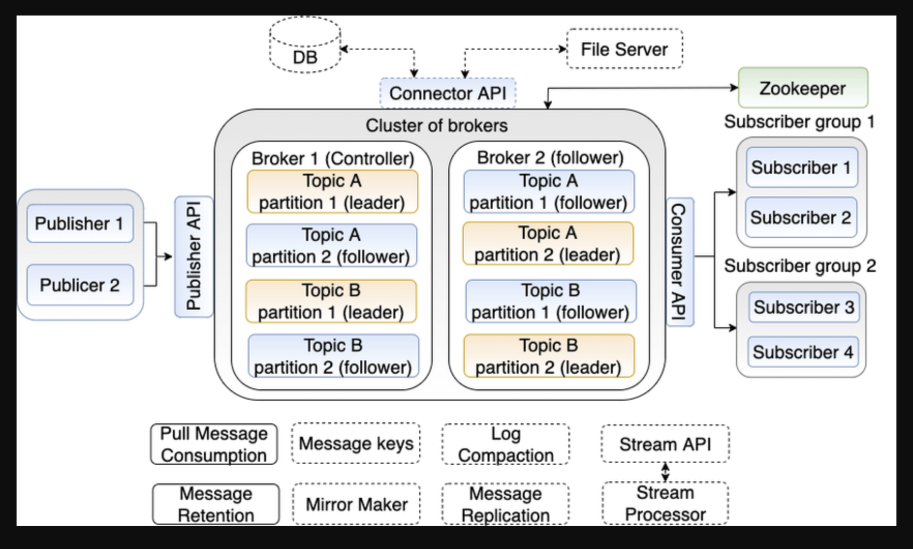

# kafka-installation

# GUI tool for kafka
https://www.kafkatool.com/   

Offset Explorer (formerly Kafka Tool) for your operating system


# Command uses 
```docker-compose up```
### Move into Kafka container
```docker exec -it <kafka_conatiner_id> /bin/sh```
### Go inside kafka installation folder
```cd /opt/kafka_<version>/bin```
### Create Kafka topic
```kafka-topics.sh --create --zookeeper zookeeper:2181 --replication-factor 1 --partitions 1 --topic quickstart```
### Start Producer app (CLI)
```kafka-console-producer.sh --topic quickstart --bootstrap-server localhost:9092```
### Start consumer app (CLI)
```kafka-console-consumer.sh --topic quickstart --from-beginning --bootstrap-server localhost:9092```

### Request get and post
```POST http://localhost:8080/publish?message=test```

```GET http://localhost:8080/consume```

```GET http://localhost:8080/consumeFromTopic?topicName=newTopic5```

# Understanding Kafka

Kafka is a distributed streaming platform designed to handle real-time data streams efficiently and reliably. It's often used for log aggregation, metrics, and stream processing.

Key Concepts  

* Producer: Sends messages to a Kafka topic.  
* Topic: A category or feed name to which producers send and consumers subscribe.  
* Consumer Group: A group of consumers that subscribe to the same topic. Each consumer in a group receives a unique partition of the topic.  
* Partition: A subdivision of a topic, allowing for parallel consumption and scalability.  
* Broker: A server node in a Kafka cluster that stores and replicates data.  


